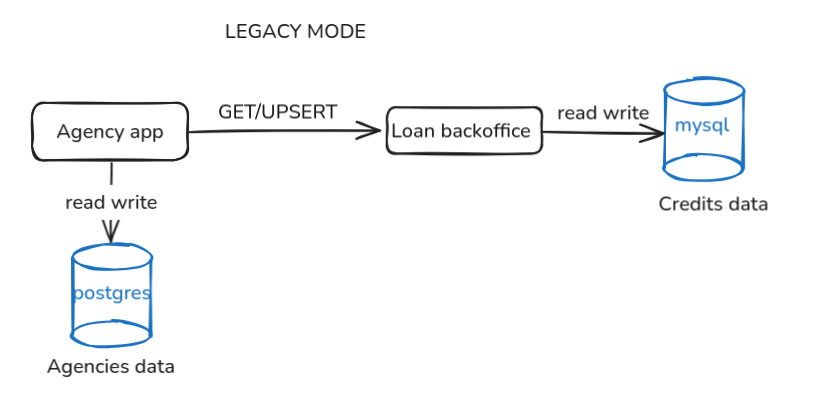
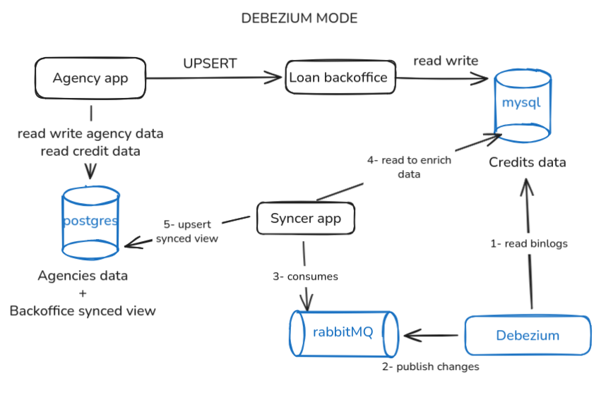

# Debezium Demo – Bank Loan Application Synchronization

## Overview

This project demonstrates near real-time data synchronization between two databases using Debezium and RabbitMQ, in a
banking loan management context.

---

## Goal

The main objective is to showcase:

- Replace high coupled applications for better read performances
- How to replicate business data from a transactional database (MySQL) to another one (Postgres).
- How to decouple reads from writes using CDC architecture.
- How Debezium + RabbitMQ + Spring Boot can work together in a simple, reproducible docker compose setup.

---

## Architecture

### Components :

| Components      | Service	Description                                                            |
|-----------------|--------------------------------------------------------------------------------|
| loan-backoffice | Bank headquarter application, handle credit applications                       |
| agency-app      | Front application simulating bank agencies front office                        |
| mysql           | Primary transactional database                                                 |
| postgres        | Frontoffice database                                                           |
| debezium        | Monitors MySQL binlog and sends change events to RabbitMQ                      |
| rabbitmq        | Message broker (change data capture bus)                                       |
| syncer          | Spring Boot service consuming Debezium events, enriching and updating Postgres |
| gatling         | Load testing tool simulating traffic for both MySQL and Postgres apps          |

### Initial coupled architecture :



### Target CDC architecture :



### Data Model (simplified)

MySQL – backoffice schema
```
CREATE TABLE agency (
    id BIGINT AUTO_INCREMENT PRIMARY KEY,
    national_id VARCHAR(50) NOT NULL UNIQUE,
    name VARCHAR(100) NOT NULL
) ENGINE=InnoDB DEFAULT CHARSET=utf8mb4;

CREATE TABLE credit_application (
    id BIGINT AUTO_INCREMENT PRIMARY KEY,
    application_number VARCHAR(50) NOT NULL UNIQUE,
    applicant_name VARCHAR(100) NOT NULL,
    applicant_email VARCHAR(100) NOT NULL,
    amount DECIMAL(12,2) NOT NULL,
    term_months INT NOT NULL,
    purpose VARCHAR(255),
    agency_id BIGINT NOT NULL,
    status ENUM('PENDING', 'IN_REVIEW', 'APPROVED', 'REJECTED') DEFAULT 'PENDING',
    last_update TIMESTAMP DEFAULT CURRENT_TIMESTAMP ON UPDATE CURRENT_TIMESTAMP,
    CONSTRAINT fk_credit_application_agency FOREIGN KEY (agency_id) REFERENCES agency(id)
) ENGINE=InnoDB DEFAULT CHARSET=utf8mb4;
```

Postgres – backoffice_view schema
```
CREATE TABLE backoffice_view.credit_application (
    id BIGINT GENERATED BY DEFAULT AS IDENTITY PRIMARY KEY,
    application_number VARCHAR(50) NOT NULL UNIQUE,
    applicant_name VARCHAR(100) NOT NULL,
    applicant_email VARCHAR(100) NOT NULL,
    amount NUMERIC(12,2) NOT NULL,
    term_months INT NOT NULL,
    purpose VARCHAR(255),
    agency_national_id VARCHAR(50) NOT NULL,
    status backoffice_view.status_enum DEFAULT 'PENDING',
    origin_last_update TIMESTAMP,
    last_update TIMESTAMP DEFAULT CURRENT_TIMESTAMP
);
```

## How to Run the Demo

Start the stack

Legacy :
```
docker compose --profile legacy up
```

CDC :
```
docker compose --profile debezium up
```

This will start: MySQL, Postgres, RabbitMQ, Debezium server, Syncer service, agency app and backoffice.
Random data will be injected in databases : 2000 agencies and 100 000 fake credit requests.

**Urls :**

| Components      | Url                                         |
|-----------------|---------------------------------------------|
| loan-backoffice | http://localhost:8280/swagger-ui/index.html |
| agency-app      | http://localhost:8180/swagger-ui/index.html |
| mysql           | mysql://localhost:3306/     (demo/demo)     |
| postgres        | postgresql://localhost:5432    (demo/demo)  |
| rabbitmq        | http://localhost:15672   (guest/guest)      |

**Example of scenario:**

1. Connect to mysql and perform a bulk update :
```
UPDATE backoffice_db.credit_application
set amount=amount+1;
```
2. Open rabbitMQ UI and check the produced messages: http://localhost:15672/#/queues/%2F/credit_changes
3. Connect to postgres and check time needed for updating data :
```
SELECT 
    MIN(last_update - origin_last_update) AS min_lag,
    MAX(last_update - origin_last_update) AS max_lag,
    AVG(last_update - origin_last_update) AS avg_lag
FROM backoffice_view.credit_application;
```


## TODO :
- finalize gatling scenario
- dynamize hard coded variables
- add gatling section in readme